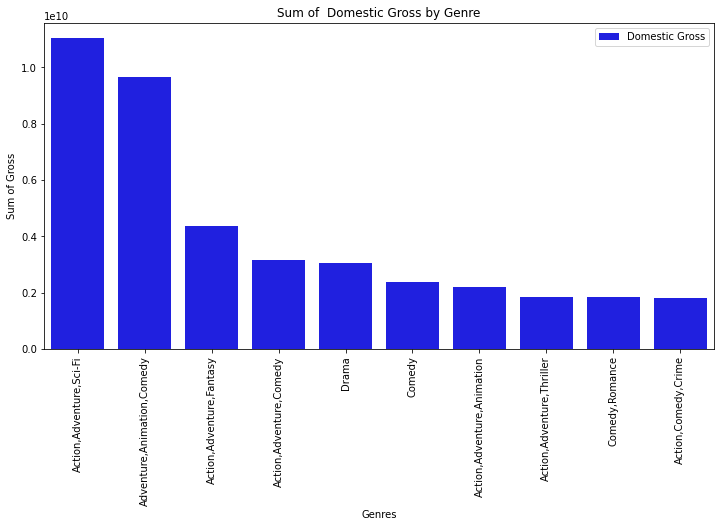
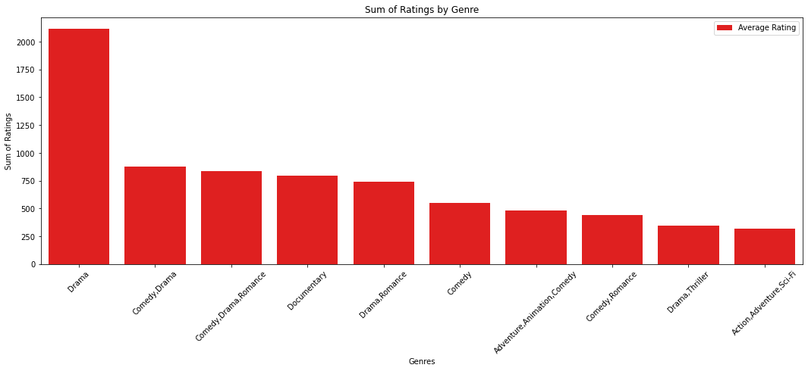
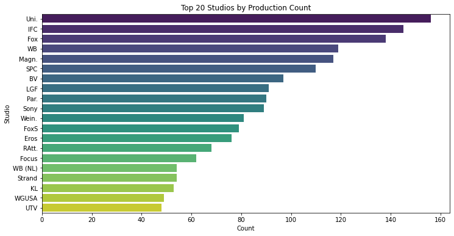
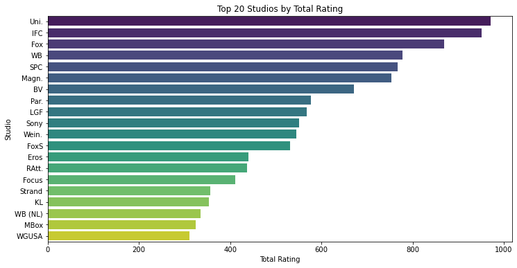
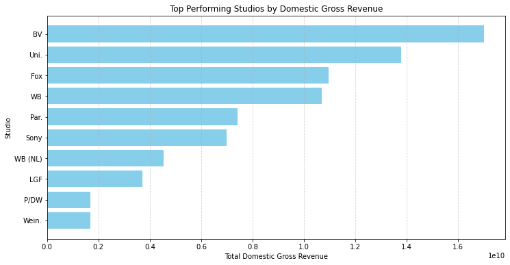
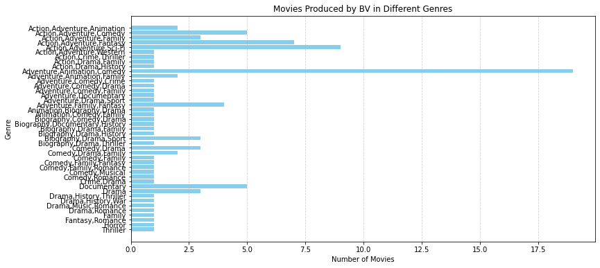
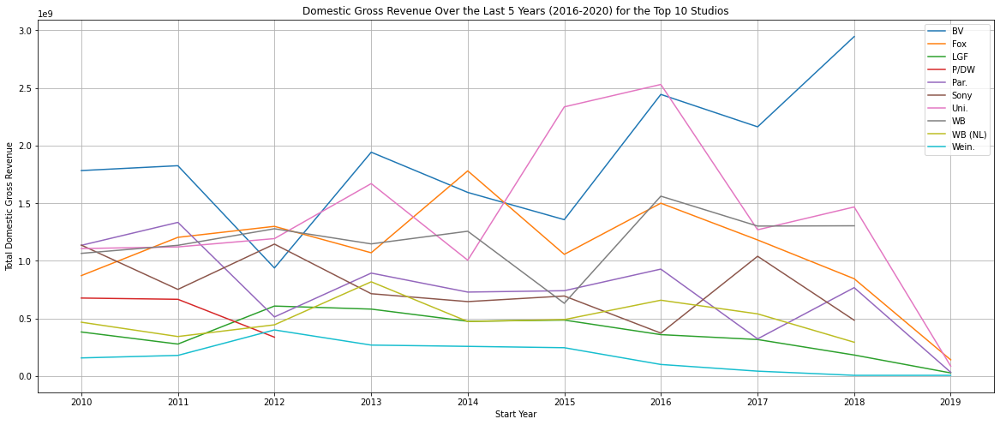

MICROSOFT MOVIE STUDIO MARKET ANALYSIS

OVERVIEW

This project analyses the market environment for the Microsoft to widen their understanding of the movie production market. This exploratory data analysis generates insights on the movie production business focusing on the relationship of genres on revenue generation and the market competition. Microsoft can use this analysis to understand the type of movies to focus on during production, the market competition, and The average movie runtime as they start production.

BUSINESS PROBLEM

Microsoft sees all the big companies creating original video content and they want to get in on the fun. They have decided to create a new movie studio, but they don’t know anything about creating movies.What types of films are currently doing the best at the box office. Translate those findings into actionable insights that the head of Microsoft's new movie studio can use to help decide what type of films to create.

DATA UNDERSTANDING

The data source is from IMDB Web site that provides information about millions of films and television programs.IMDB data goes through consistency checks to ensure it's as accurate and reliable as possible.This data will help Microsoft to get the type of movies and the turnover.

METHODS
This exploratory data analysis generates insights on the movie production business focusing on the relationship of genres on revenue generation.

MAIN DATA ANALYSIS AND RESULTS

Q1. Which type of movie generates most revenue?

The genre which has combined Action,Adventure and Sci fi had the highest return in terms of gross return,followed closely by Animation comedy.This is clearly showing the movie market that sells.

Q2. Which type movie has high average rating?

The type of movie with the most ratings is drama.This shows the market rating from the viewers- which could translate to the viewership of the studio and the algorithim hence high recommendations to view.

Q3 Which studio has the most production of movies and which studio has high rating
      

	

There is a positive correlation of productions and and the ratings.The above graph shows the studio with the most productions has the most ratings.This is a clear picture of the studio that is dominating the market having the most productions hence the high viewership.

Q4.What is the average running time per studio?
In order for the manager to make decisions they will need to know when editing the movie the ideal time to run.
	

The range for runtime of a movie is as the mean show of 106minutes with an upper quantile of 118 minutes.This is the ideal time as per market

Q5 Which studios are the top performers in terms of revenue?

The studios with high yield in revenue do not have the most production this could translate to the good quality of movies they may be producing making the sales.There is need to do more research on this.

Q6 Which Genre does the top revenue earner produce?

The studio with the highest total domestic gross revenue is: BV
The genres produced by this studio are: Adventure,Animation,Comedy, Action,Adventure,Sci-Fi, Action,Drama,Family, Biography,Drama,History, Action,Adventure,Fantasy, Action,Adventure,Comedy, Action,Adventure,Family are just some that they produce.

Q7 What has been the trend of revenue for the past 5years?

For the year 2019 there has been a decline on the domestic gross revenue there is need to do more research on the market effects that could have caused the drop.

RECOMMENDATIONS
Microsoft should look at BV studio for best practices since their revenue growth has been on upward trajectory and they also produce the most popular genres.They should also look at the uni studio which has the most productions.

Microsoft should produce movies that combined Action,Adventure and Sci fi had the highest return in terms of gross return,also the comedy animation and drama is a key genre.Therefore source for actors and actresses that are highly skilled

Microsoft while planning to produce the movies should have a plan of a run time of a mean of 106 minutes with the highest quantile being 118 minutes.

Further Analysis
There is need for more research to be done to understand why the revenue has been declining in the past year.

